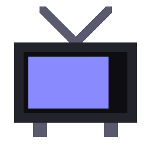

# HomeStream

같은 Wi-Fi에 연결된 **휴대폰에서 PC/USB 안의 영상을 브라우저로 재생**하는 로컬 스트리밍 서버입니다.
영상을 외부로 업로드하지 않고 내 네트워크 안에서만 전송합니다.

[](https://github.com/wooni-dev/homestream/releases/latest)
[](https://dotnet.microsoft.com/)

---

## 다운로드

**[홈페이지에서 다운로드](https://gethomestream.com/)** (Windows 단일 실행파일)

또는 [GitHub Releases](https://github.com/wooni-dev/homestream/releases/latest)에서 직접 받을 수 있습니다.

---

## 미리보기



---

## 특징

- **모바일 전용 UI** — 폴더 탐색 + 다크 테마 영상 플레이어
- **탐색(seek)·일시정지 지원** — HTTP Range 요청 처리로 모바일에서 정상 동작
- **GUI 설정** — 영상 폴더를 앱 안에서 직접 변경
- **QR 토큰 인증** — QR 스캔으로 접속, 자격증명이 네트워크를 타지 않음
- **다국어 GUI** — OS 언어가 한국어면 한국어, 그 외에는 영어로 표시
- **단일 실행파일** — .NET 런타임 없이 더블클릭 실행 (self-contained)
- **읽기 전용** — 파일을 수정·삭제·이동하지 않음
- **외부 라이브러리 없음** — .NET BCL만 사용

---

## 지원 영상 형식

`.mp4` `.mkv` `.avi` `.mov` `.wmv` `.m4v`

---

## 요구사항

- PC와 휴대폰이 **같은 Wi-Fi**에 연결
- Windows x64
- 실행파일 사용 시 .NET 런타임 불필요 (self-contained)

---

## 빠른 시작

1. [홈페이지](https://gethomestream.com/)에서 `HomeStream.exe` 다운로드
2. 더블클릭으로 실행
3. **영상 폴더**를 선택하면 QR 코드와 접속 주소가 표시됨
4. 폰 카메라로 QR 스캔 → 폴더·영상 목록에서 재생

> 창을 닫으면 서버가 꺼집니다. 켜둔 동안만 접속됩니다(최소화는 OK).

---

## 설정

영상 폴더는 앱 실행 시 다이얼로그에서 선택합니다. 환경변수로도 지정할 수 있습니다.

| 환경변수 | 설명 |
|------|------|
| `SERVE_DIR` | 스트리밍할 영상 폴더 경로 (설정 시 다이얼로그 생략) |

---

## 소스에서 빌드

```powershell
# 빌드
dotnet publish HomeStream.csproj -r win-x64 --self-contained -p:PublishSingleFile=true -p:Configuration=Release -o dist

# 실행
dotnet run
```

→ `dist/HomeStream.exe` 생성.

---

## GitHub Releases 배포

태그를 push하면 GitHub Actions가 자동으로 빌드·릴리즈합니다.

```bash
git tag v1.x.x
git push origin v1.x.x
```

---

## 웹사이트 (`homestream-web`)

릴리즈 다운로드 페이지는 별도 레포 [`wooni-dev/homestream-web`](https://github.com/wooni-dev/homestream-web)으로 관리되며 Cloudflare Pages에 배포됩니다.

- **URL**: https://gethomestream.com/
- **배포**: `homestream-web` 레포에 push하면 Cloudflare Pages가 자동 배포. 또한 이 레포에 새 릴리즈가 배포되면 Cloudflare Deploy Hook을 통해 자동 재빌드됩니다.

---

## 보안 / 네트워크 범위

- 기본은 **같은 Wi-Fi 안에서만** 접속 가능하며, 인터넷 외부에는 노출되지 않습니다(공유기 NAT + 방화벽).
- 기본 포트: **8000** (방화벽에서 허용 필요 — Windows는 첫 실행 시 팝업에서 허용)
- **QR 토큰 인증** — QR 코드 스캔 없이는 접속 불가. 자격증명이 네트워크를 타지 않아 HTTP 평문 전송 문제 없음.
- 외부에서 접속이 필요하면 **Tailscale / WireGuard / SSH 터널** 같은 암호화 통로 안에서 사용하세요.

---

## 구성

| 파일/폴더 | 용도 |
|------|------|
| `Program.cs` | 진입점 |
| `Gui/MainForm.cs` | WinForms GUI |
| `Server/StreamServer.cs` | HTTP 서버 (HttpListener) |
| `Server/AuthManager.cs` | 토큰 발급·세션 쿠키 검증 |
| `Qr/` | QR 코드 직접 구현 (Reed-Solomon 포함) |
| `Web/` | 인라인 HTML/CSS 렌더러 |

---

## 문제 해결

| 증상 | 원인 / 해결 |
|------|------------|
| 폰에서 페이지가 안 열림 | 같은 Wi-Fi인지 확인. 게스트 와이파이는 기기 간 차단될 수 있음 |
| 영상만 재생 안 됨 | 코덱 문제일 수 있음 (대부분 mp4는 정상) |
| 처음 실행 시 접속 불가 | Windows 방화벽 팝업에서 "개인 네트워크 허용" 클릭 |
| 포트 8000이 이미 사용 중 | 8000~8009 범위에서 자동으로 다음 포트로 전환됨 |
